# Detectção de anomalias em dados do processo de estimativa de reservas

#### Aluno: [Leonardo Cardoso Vicente] (https://github.com/lcvicente).
#### Orientador: [Leonardo Forero Mendonza] (https://github.com/leofome8).

---

Trabalho apresentado ao curso [BI MASTER](https://ica.puc-rio.ai/bi-master) como pré-requisito para conclusão de curso e obtenção de crédito na disciplina "Projetos de Sistemas Inteligentes de Apoio à Decisão".

---

# Resumo

A estimativa de reservas é uma importante atividade na indústria de petróleo e gás. Por meio dela, as empresas avaliam a economicidade de seus projetos de produção e investimento. Entidades governamentais exigem que as empresas realizem este processo seguindo metodologias certificadas e reconhecidas internacionalmente. As reservas estão associadas à capacidade da empresa em gerar receita através da venda da produção.

As entradas deste processo consistem em planejamentos futuros (projeções) de diversas disciplinas tais como: custos operacionais, custos com abandonos, investimentos (ex.: perfuração de novos poços e entrada de novas unidades) e curvas de produção. Estas projeções são classificadas usando critérios estabelecidos em metodologias de referência, defindo as parcelas que correspodem a cada classe de reserva (que possui algumas variações dentro dos grupos de classe Provada, Provável, Possível e Recursos Contingentes).

A incerteza é um fator predominante. A curva de produção, que se transforma em curva de receita, deve considerar uma base de preços de referência (ex.: _petróleo brent_), assim como uma taxa de conversão (câmbio) para a moeda utilizada, que também afeta projeções de custos e investimentos por exemplo.

Além da incerteza inerente ao processo, outros fatores contribuem para sua complexidade:
- Cada grupo de variáveis se divide em séries específicas.
- As análises devem considerar cenários de incerteza (ex.: otimista, pessimista, realista).
- Cada análise deve ser feita para cada plataforma existente, considerando ainda a multiplicação de dimensão quando se considera a zona de produção (variável relacionada a reservatórios).
- O processo deve estar alinhado com outros processos da empresa.

As séries de dados tratados possuem um comportamento implícito. Individualmente as variáveis possuem um padrão minimamente definido e conhecido. Existe também relação entre variáveis: duas séries `var_a` e `var_b` podem ter comportamentos normais quando olhadas individualmente, mas podem não fazer sentido quando analisadas em conjunto.

O objetivo do trabalho é encontrar e analisar comportamentos implícitos nos dados e utilizar este comportamento para identificar _outliers_ em novas projeções. Como projeção subentende-se uma matriz na qual cada linha representa um período temporal (ano) e cada coluna representa uma variável.

Foram testadas metodologias basedas em cluserização, comparando uma nova projeção (`matriz_p`) com comportamentos padrões encontrados em dados históricos, medindo o “grau de aderência” (confiabilidade) de `matriz_p` com cada um dos padrões existentes. A projeção é rotulada como como _outlier_ caso seu grau de aderência esteja acima de um limite calculado. A identificação de um elemento como anômalo é feita a partir do cálculo de distâncias para os centroides comparado a uma estatística previamente calculada.

O mesmo conjunto de dados é submetido também para processamento com redes neurais artificiais, configuradas para reproduzir o próprio dado de entrada na camada de saída. A identificação de anomalia é feito a partir do erro obtido entre _entrada_ e _saída_.

Por se tratar de dados sensíveis, este documento trata das técnicas utilizadas omitindo os dados reais.

# Contexto do problema

De forma resumida os dados originais são agrupados em 9 categorias, representando as variáveis econômicas (ex.: custos e investimentos) e volumétricas (ex.: produção de óleo e gás). Essas categorias possuem valores para cada período da série temporal. A figura abaixo traz um exemplo hipotético do esquema de representação utilizado considerado um período temporal estendido a 30 anos (2022 a 2051).
 


A existência de um mecanismo que melhore a confiabilidade sobre os dados processados pode ser útil para aumentar a qualidade do processo como um todo. Uma série de etapas e detalhes presentes no processo resultam em modificações e ajustes nestas projeções, aumentando a chance de erros.

Mecanismos determinísticos existentes nos sistemas deste processo tratam uma variedade de inconsistências possíveis. Um exemplo típico de inconsistência é: caso exista valor válido (maior que zero) para a variável `var_a` em determinado ano, obrigatoriamente deve haver valor válido para a variável `var_g`.

No entanto, mesmo atendendo os requisitos de consistência, é possível que os dados contenham comportamentos que necessitem de atenção. Um dígito equivocado a mais em um determinado valor, por exemplo, pode causar uma distorção relevante na análise final e ser de difícil identificação.

O trabalho se propõe a atuar neste contexto comportamental, através de um algoritmo que identifique distorções em relação a padrões existentes nos próprios dados. Para o contexto deste trabalho foi considerada a análise de duas séries de entrada, que serão referenciadas como `var_a` e `var_b`.

# Tratamento dos dados

Em geral, o processo de análise em ciência de dados possui uma etapa de pré-processamento visando realizar ajustes nos dados e deixá-los em formato adequado. Através de um conhecimento prévio da estrutura e representação dos dados para o negócio e tendo em vista o objetivo da análise, foram aplicadas transformações utilizando técnicas de seleção de atributos, criação de _features_, preenchimento de valores ausentes e normalização. A motivação para cada uma dessas etapas segue explicada neste tópico.

## Representação dos dados e dinâmica de análise

Antecedendo as transformações realizadas, é importante destacar o planejamento da representação dos dados para a análise proposta. O exemplo hipotético e simplificado abaixo traz uma representação dos dados no formato original desta análise, filtrados pelas variáveis selecionadas para análise. Neste exemplo existem dados de três plataformas (PLAT1, PLAT2 e PLAT3). Os valores representados por `var_a` e `var_b` estão anualizados (coluna `ano`).

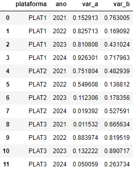

A ideia é comparar o comportamento de valores da cada plataforma para identificar comportamentos anormais. Pode-se afirmar que o exemplo contém três conjuntos de valores (cada conjunto referenciando uma plataforma). Para a análise, os dados foram transformados para o formato da figura abaixo, com o elemento de comparação indexado (coluna `plataforma`) e tendo seus dados representados em colunas, favorecendo assim a comparação entre os elementos. Nesta representação, a variável `ano` passa por uma transformação, explicada em detalhes a seguir, passando a iniciar em `0`, sendo incrementado de forma sequencial.


## Seleção de atributos

Projeções de curva podem ter dimensão temporal diferentes. Duas plataformas (A e B) com mesmo ano de início de operação podem ter curva de 20 anos para a plataforma A e 25 anos para a plataforma B por exemplo. Faz parte do processo de negócio definir o período temporal que será considerado para cada plataforma. Tendo esse período definido, os dados posteriores ao ano definido são desconsiderados. É normal que as projeções contenham períodos de dados bem alongados para subsidiar análises em diferentes cenários.

Na representação de dados adotada neste trabalho (figura acima), o período (variável ano) compõe os atributos de entrada (representados nas colunas). Os algoritmos que foram utilizados neste trabalho, assim como a maioria dos algoritmos de ciência de dados, requerem que o dado de entrada possuam mesma dimensão. Desta forma foi preciso definir uma janela temporal para padronizar os dados. Esta definição foi feita a partir da distribuição estatística das dimensões nos dados de cada elemento de análise , utilizando como referência o valor que representa 75% das dimensões dos dados. Esta definição indica por exemplo que todos os elementos de anaálise serão processados considerando 20 anos de projeção.

A dimensão temporal dos dados definida nesta etapa é utilizada em outras partes do processo de tratamento de dados e será referenciada no restante do documento como `DIMENSAO_TEMPORAL_PADRAO`.

## Alinhamento temporal

Uma característica de negócio presente nos dados é que os elementos de análise podem estar em estágios temporais diferentes. Plataformas em estágio final de vida útil podem possuir operação por mais 2 ou 3 anos. Em outro extremo, plataformas novas podem ter operação prevista de 30 ou mais anos. Como o processo de estimativa de reserva é feito considerando o planejamento futuro, dados do passado não são considerados.

Tendo por exemplo uma plataforma A em fim de operação (com projeção de curva para 2 anos) e plataforma B sendo uma plataforma em estágio inicial de produção com projeção de curva para mais 30 anos. Para um mesmo ponto no tempo (ex: ano = 2022), os dois elementos teriam comportamentos bem distintos (plataforma A com valores próximos ao seu máximo e plataforma B próximos ao seu mínimo), mas mesmo assim dentro do padrão esperado para seu estágio operacional. Curvas de produção de óleo podem possuir valores ascendentes no início da série, seguindo um padrão de declínio no decorrer do tempo.

Faz-se necessário ajustar os dados para que possuam a mesma referência temporal. No exemplo do parágrafo anterior, os dados referentes ao último ano da plataforma A devem estar na mesma referência do último ano da plataforma B. Para isso foi criada a coluna `ano_aj` no conjunto de dados. Os valores desta colunas são calculados após o redimensionamento dos dados na etapa "Seleção de atributos". Considera-se que último ano de cada plataforma corresponde ao valor `DIMENSAO_TEMPORAL_PADRAO` (ex.: 20 anos). A partir deste preenchimento inicial, os anos são decrementados ao percorrer a série de forma inversa.

Ao final desta etapa, a coluna `ano_aj` possui as referências de tempo equalizadas para comparação.

## Preenchimento de valores ausentes

Embora os dados originais não possuam valores ausentes, as transformações realizadas podem causar a inclusão de valores nulos. Elementos de análise que possuem dimensão original menor que `DIMENSAO_TEMPORAL_PADRAO` tiveram sua dimensão aumentada para atender à padronização de dimensão dos dados de entrada.

A partir da coluna `ano_aj`, foi verificada a **variação mediana** de valor que ocorre em cada período (`t[i] / t[i-1]`) para cada variável. Os elementos com dados ausentes foram preenchidos com dados fictícios calculados a partir da variação mediana calculada. Este preenchimento fictício não trouxe prejuízo para o objetivo da análise, uma vez que os dados foram preenchidos com um comportamento mediano (não anômalo).

## Criação de _feature_

Para o par de variáveis analisada, é criada uma nova variável contendo a divisão entre o par de variáveis. Esta etapa visa agregar mais informação aos dados através da relação direta entre as duas variáveis analisadas.

## Normalização

A normalização é feita no escopo de cada elemento de análise. Os dados das plataformas são transformados considerando o range de valores de cada variável associada à plataforma. Isso permite extrair o comportamento das séries em cada plataforma, possibilitando o algoritmo de detecção identificar padrões e anomalias. O método utilizado para normalização foi o _Standart Scaller_.

```
# Pseudo-código
Para cada plataforma "p":
    df_p = Filtra os dados de entrada da plataforma p
    Para cada série de valores "v":
        df_p[v] = normaliza(df_p[v]) # Usa a série v da plataforma p
                                     # para normalizar os valores usando o método Standart Scaller
```

## Ajuste de representação

Para que os dados assumam formato a ser processado pelo algoritmo de detecção de anomalias (conforme figura da etapa "Representação dos dados e dinâmica de análise"), as variáveis de entrada devem ser agrupadas com a variável `ano_aj`. Esta transformação foi feita através do comando abaixo:

```
df_flat = df_norm.pivot_table(
            values=COLS_VALORES_AN_TOTAL,
            index=['origem_campo_plataforma'],
            columns=['ano_aj']
            )
```

## Analisando e visualizando os dados

A partir da representação obtida com as transformações, é possível verificar a distribuição de cada atributo conforme exemplo abaixo. Os histogramas demostram que a maioria das variáveis se aproximam de uma distribuição normal. Embora o foco do trabalho ser em métodos de clusterização e redes neurais, os histogramas deixam evidentes a existência de alguns _outliers_, que podem ser explorados com outras técnicas.

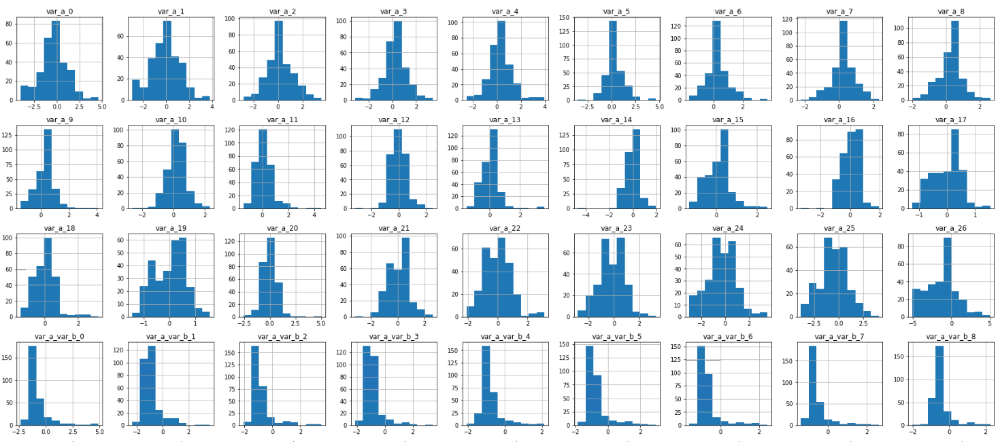

## Visualizando dados em dimensão reduzida

O método estatístico TSNE (_T-Distributed Stochastic Neighbor Embedding_) realiza redução da dimensionalidade de dados de forma não linear, visando otimizar ao máximo a representação dos dados. Neste caso, foi feito um processamento para visualizar os dados em duas dimensões (após todas as etapas de tratamento, os dados processados neste trabalho possuíam 81 dimensões).

A representação foi feita conforme segue.

```
from sklearn.manifold import TSNE
tsne = TSNE(n_components=2, random_state=0)
tsne_values = tsne.fit_transform(df_flat)
df2dim = pd.DataFrame(columns=['D1', 'D2'], data=tsne_values)
df2dim.index = df_flat.index
df2dim.plot(x='D1', y='D2', style='o')
```

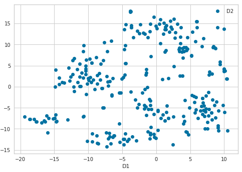

Este passo foi feito apenas para permitir uma visualização dos dados, sem realizar alterações nos dados a serem processados pelos algoritmos de tratamento de anomalia.

# Identificação de anomalias

Dados históricos de processos passados foram utilizados como referência para o modelo extrair conhecimento. Foram utilizadas três abordagens diferentes para identificar anomalias.

## Métodos baseados em clusterização

Inicialmente os dados são submetidos ao algoritmo _KElbow_ buscando identificar quantidade ideal de clusters para segmentar os dados.

```
from yellowbrick.cluster import KElbowVisualizer
from sklearn.cluster import KMeans

km = KMeans()
visualizer = KElbowVisualizer(km, k=(2, 10))
visualizer.fit(df_flat)
visualizer.show();
```


Em seguida, os dados são processados pelo algoritmo K-Means utilizando a quantidade de clusters definida pelo Elbow.
```
n_clusters = visualizer.elbow_value_
km = KMeans(n_clusters=n_clusters).fit(df_flat)
df_flat['cluster'] = km.labels_

sns.countplot(x=km.labels_)
```


 
Além da associação de cada elemento a um cluster, é calculada distância euclidiana para cada centroide. Desta forma, é computada a distância do elemento tanto para seu cluster quanto para os demais. Na figura abaixo, cada linha representa uma plataforma e as colunas se referem ao cluster associado e às distâncias para cada centroide. Conforme lógica do _K-Means_, observa-se a menor distância de cada elemento (colunas _dist_) corresponde ao seu cluster associado (coluna _cluster_)


### Identificação de _outlier local_

Uma forma de identificar anomalias é considerar um elemento como anômalo caso a distância para seu centroide exceda um limite padrão. Este trabalho considera este método como _outlier local_.

O limite padrão para cada centroide `c` pode ser definida como:

```
# Pseudo-código
x = 1
distancias = []
Para cada elemento "e" associado ao centroide "c":
    armazena a distância euclidiana de "e" para "c" ao fim na lista "distancias"
limite[c] = mediana(distancias) + x * desvio_padrao(distancias)
```
Podendo `x` ser definido como um fator de sensibilidade permitindo identificar mais elementos ou menos elementos como anomalia, que no case deste trabalho ficou definido `x = 1`.

### Identificação de _outlier global_

Este trabalho propôs uma metodologia complementar, considerando também a distância para outros centroides. Na figura abaixo, considerando que o raio mais próximo aos centroides é a zona de confiança (`mediana + fator_sensibilidade * desvio_padrão`) e o raio maior é a fronteira da área do cluster, os dois elementos destacados seriam rotulados como anômalos. No entanto, o elemento 2 possui mais similaridade com os outros centroides em comparação ao elemento 1, que está mais distante dos demais centroides.

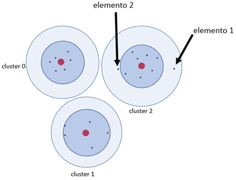
 
Neste caso, a distância do elemento 2 para o seu centroide pode ser compensada por sua leve proximidade com outros centroides, tornando-o um elemento “não anômalo”. Já a anomalia do elemento 1 é "aumentada" devido sua distância para todos os centroides.

O processo se resume em calcular um valor denominado “distância relativa total” para cada um dos elementos. A partir da distribuição estatística desta distância, os elementos que possuem maiores distâncias são considerados anômalos. O cálculo é feito no seguinte fluxo:

1.	Calcular a distância euclidiana de cada elemento para cada centroide

    

2.	Calcular estatística dos elementos em relação a cada centroide
    ```
    # Pseudo-código
    Para cada centroide "c": # Percorre cada centroide e o referencia na variável c
        elementos = Selecione os elementos associados ao centroide c
        Para cada centroide "k": # Percorre cada centroide e o referencia na variável k
            Calcule a mediana e desvio padrão de "elementos" considerando suas distâncias para k
    ```
    Ao final, deste processo, obtém-se resultados como os exemplificados abaixo.

    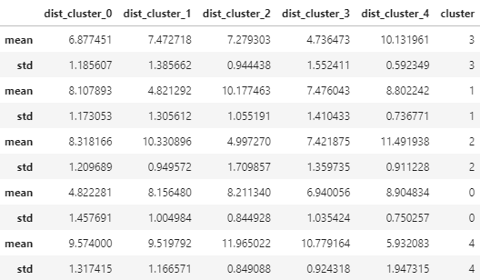

        
3.	Identificar distância de referência para cada centroide somando as estatísticas calculadas no passo anterior (`mediana + desvio padrão`)

    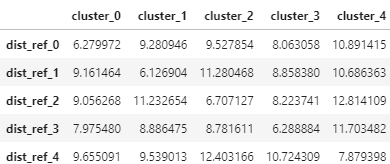

4.	Calcular a distância relativa de cada elemento para cada centroide
    ```
    # Pseudo-código
    Para cada elemento "e":
        k = Verificar o cluster que o elemento "e" está associado
        Para cada centroide "c":
            distancia_relativa[e,c] = dist_euclid[e,c] / dist_refer[k, c]
    ```
    A fórmula aplicada neste passo representa a razão entre a distância de cada elemento `e` para uma distância referencial entre o centroide `c` e os elementos do centroide `k` (centroide associado ao elemento `e`).
    
    Resultados próximos ou maiores que 1 representam uma distância relativa alta em relação à amostra.
    
    Este passo realiza uma normalização das distâncias dos elementos para os centroides, expressando-as de forma proporcional às distribuições das distâncias observadas no universo amostral.

    O histograma abaixo mostra a distribuição dos dados para cada distância relativa calculada.

    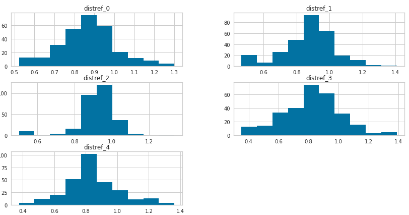


5.	Calcular a distância relativa total para cada elemento
    ```
    # Pseudo-código
    Para cada elemento "e":
        distancia_relativa_total[e] = 0
        Para cada centroide "c":
            distancia_relativa_total[e] += distancia_relativa[e,c]
    ```
    
6.	Calcular a distância relativa global a partir da estatística (mediana + desvio padrão) do vetor resultante do _passo 5_
    ```
    # Pseudo-código
    distancia_relativa_global = mediana(distancia_relativa_total) + desvio_padrao(distancia_relativa_total)
    ```

A distribuição de valores de `distancia_relativa_global` é usada para identificar anomalias. Elementos cuja `distancia_relativa_total` sejam maiores que `distancia_relativa_global` são considerados anômalos. O histograma mostra a distruição dos valores calculados.


A figura abaixo exemplifica os valores de cada elemento calculados neste processo.


## Método baseado em rede neural

A partir da proposta de redes neurais _auto-encoders_, foi implementada uma arquitetura de rede neural que tenta reproduzir em sua saída o próprio dado de entrada. Assume-se a hipótese que a rede ajustará seus parâmetros com base em padrões observados nos dados, sendo capaz de reconstruir (com poucos ruídos) o dado de entrada na sua camada de saída. A existência de algum dado anômalo (fora do padrão) na camada de entrada causa um índice elevado de erro ao reconstruir o dado na camada de saída. O erro (comparação entre entrada `X` e saída `Y`) é utilizado como métrica de anomalia. Erros próximos de zero indicam que rede conseguiu reconstruir o dado com qualidade.

A arquitetura da rede foi configurada conforme segue.

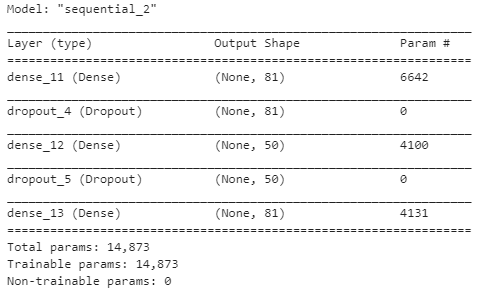

A curva de erro do treinamento está ilustrada na figura abaixo.

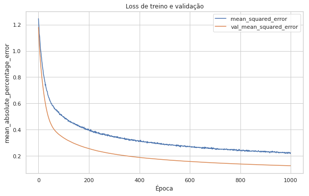

Analisando os erros, foi obtido o gráfico _box-plot_ abaixo.

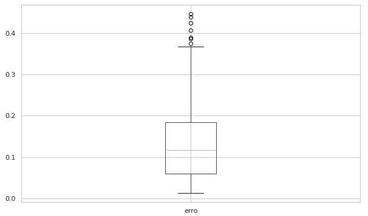

Seguindo a mesma linha estatística usada nos métodos de clusterização, foi verificado a mediana e desvio padrão da distribuição dos valores de erros. Foi definido que um valor de erro acima do limite (`mediana + desvio_padrão`) identifica o elemento como anômalo.

# Resultados e conclusões

Os resultados demonstraram uma boa aplicabilidade da metodologia ao processo. Além da identificação de comportamentos anômalos, foi possível também identificar os comportamentos predominantes nos dados plotando os valores dos centróides.

Houve grande esforço na etapa de preparação dos dados para o objetivo da análise. Os dados passaram por várias etapas de transformação até chegar à representação adotada para processamento dos algoritmos. Ainda nesta etapa foi necessário assumir algumas premissas de negócio sobre os dados, como o alinhamento temporal e a definição da `DIMENSAO_TEMPORAL_PADRAO`. Com base nos resultados produzidos, foi verificado que as transformações feitas nesta etapa conseguiram realizar uma reprsentação adequada.

Era esperado que alguns dados legítimos fossem rotulados como anômalos, e esta expectativa se confirmou. No entanto, esta situação não invalida as metodologias, uma vez que na maioria dos casos, eram particularidades pontuais em alguns dados.

Os métodos de identificação de outliers _local_ e _global_ produziram os mesmos resultados para 266 elementos dos 291 analisados, correspondendo a 91% dos casos. A metodologia ajustada de uso do algoritmo `K-Means` para identificação de anomalias teve motivação em considerar as distâncias de um elemento comparado a todo universo amostral e não somente ao seu cluster. Embora tenha produzido bons resultados, esta metodologia precisa ser testada de forma mais exaustiva para ter sua eficiência avaliada. Os resultados produzidos por ambas metodologias estão detalhados na figura abaixo em forma de matriz de confusão.

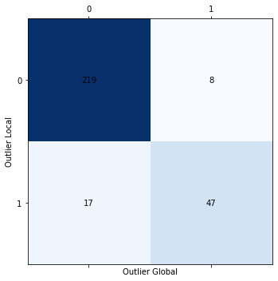

Comparando a metodologia usando redes neurais com as metodologias usando clusterização, foram obtidos resultados próximos aos resultados da metodologia com cluster. Esses resultados estão resumidos na figura abaixo.

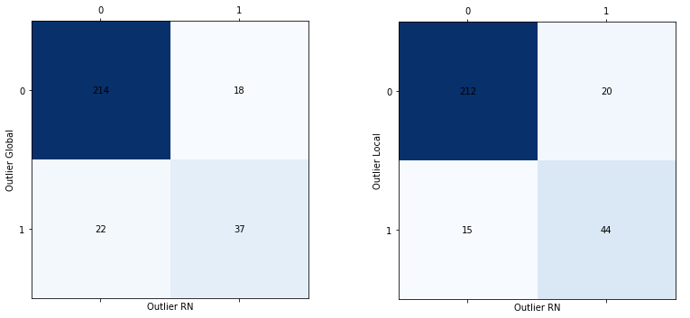

Esses resultados demonstram que os dados recebem o mesmo diagnóstico para a maioria dos casos com base nos algoritmos testados. O `fator de sensibilidade` (multiplicador do `desvio padrão`) foi mantido com valor `1`, ampliando a quantidade de elementos identificados como anômalos. Este indicador precisa ser testado com valores maiores, reduzindo assim a ocorrência de falsos positivos. Este teste deve ser feito acompanhado com especialistas de negócio para adotar o uso de um valor que otimize o resultado final.

Para o objetivo deste trabalho, todo o universo de dados foi utilizado no contexto de treinamento. Entretanto, como possível adoção desta metodologia no processo, o tratamento dos dados está sendo adaptado para considerar uma etapa de treinamento e outra de deteção. Está sendo considerado também rodar o algoritmo para cada combinação de séries. A ideia é que o algoritmo de detecção de anomalia realize rodadas processando todas as séries do conjunto de dados de forma particionada, onde cada rodada processa um par de séries.

Algumas possibilidades de derivação deste trabalho podem focar em:
- Melhorar a definição de métrica de distância para identificação de anomalias
- Implementar lógica considerando o resultado das 3 metodologias implementadas, utilizando um sistema de votação (ex.: o resultado de cada elemento será o que tiver dois ou mais votos)
- Implementação da técnica de somas cumulativas (_cumsum_).